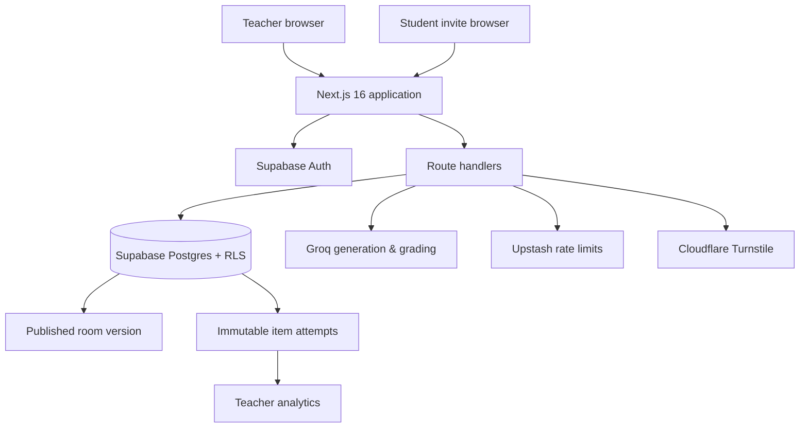
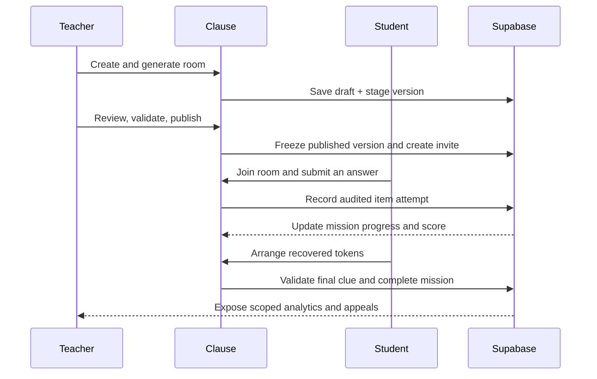

# Clause

<p align="center">
  <strong>Story-led grammar missions with teacher control and actionable classroom insight.</strong>
</p>

<p align="center">
  <a href="https://clause-learn.vercel.app"></a>
  <a href="https://github.com/not3zra/clause/actions/workflows/quality.yml"></a>
  
  
  
</p>

Clause turns grammar practice into short, teacher-reviewed missions. Teachers generate and publish a themed room; students solve staged language puzzles and a final token lock; the teacher dashboard surfaces completion, scoring, first-attempt accuracy, hints, and appeals.

**[Open the live app](https://clause-learn.vercel.app)** · **[Read deployment notes](docs/DEPLOYMENT.md)** · **[Report an issue](https://github.com/not3zra/clause/issues)**

## At a glance

| Teacher experience | Student experience | Built for accountability |
| --- | --- | --- |
| Create a class, generate a room, review it, then publish a room-specific invite. | Work through story-led grammar stages, recover tokens, and solve the final clue. | Frozen published room versions, immutable item-attempt evidence, scoped analytics, and appeals. |

## Product walkthrough

| Teacher studio | Student mission | Results dashboard |
| --- | --- | --- |
| _Screenshot placeholder — add `docs/screenshots/teacher-studio.png`_ | _Screenshot placeholder — add `docs/screenshots/student-mission.png`_ | _Screenshot placeholder — add `docs/screenshots/results-dashboard.png`_ |

## Core capabilities

- **Guided room authoring** — teachers choose a grade, grammar focus, theme, and stage count; generated content remains editable and must be reviewed before publishing.
- **Reliable AI-assisted generation** — Groq drafts are structurally validated, rate-limited, retried for transient provider limits, and replaced with a theme-specific safe fallback when needed.
- **Mission-based learning** — students complete deterministic or free-text grammar activities, collect stage tokens, and solve an ordered final clue to finish.
- **Evidence-based feedback** — every submitted item records its answer, verdict, source, recommendation, credit, and hint usage as immutable evidence.
- **Teacher analytics** — teachers can inspect progress, first-attempt accuracy, scores, elapsed time, mastery signals, and appeal history for their own rooms.
- **Safety by design** — row-level access controls, server-side authorization, rate limiting, Turnstile support, and audit records protect classroom workflows.

## Architecture



### Mission lifecycle



## Quick start

### Prerequisites

- Node.js 20+
- A Supabase project
- A Groq API key for AI generation and free-text grading

### Install

```bash
git clone https://github.com/not3zra/clause.git
cd clause
npm ci
copy .env.example .env.local
npm run dev
```

Open [http://localhost:3000](http://localhost:3000).

> On macOS or Linux, use `cp .env.example .env.local` instead of `copy`.

### Configure services

Populate `.env.local` from `.env.example`. Never commit real values.

| Service | Required variables | Purpose |
| --- | --- | --- |
| Supabase | `NEXT_PUBLIC_SUPABASE_URL`, `NEXT_PUBLIC_SUPABASE_PUBLISHABLE_KEY`, `SUPABASE_SECRET_KEY` | Authentication, data, RLS, and RPCs |
| Groq | `GROQ_API_KEY`, `GROQ_MODEL` | Room generation and free-text grading |
| Upstash | `UPSTASH_REDIS_REST_URL`, `UPSTASH_REDIS_REST_TOKEN` | Durable request limits |
| Turnstile | `TURNSTILE_SECRET_KEY`, `NEXT_PUBLIC_TURNSTILE_SITE_KEY` | Teacher sign-up protection |

Apply Supabase migrations in filename order before testing the full assigned-room flow:

```text
supabase/migrations/
```

## Quality checks

```bash
npm run lint
npm run typecheck
npm test
npm run build
npm run test:e2e
```

For a deployment smoke test:

```bash
SMOKE_URL=https://clause-learn.vercel.app npm run smoke:deployment
```

## Project structure

```text
src/
  app/                 Next.js pages and route handlers
  components/          Teacher and student experiences
  lib/                 Validation, scoring, analytics, and service adapters
supabase/migrations/   Schema, RLS, audit, and RPC definitions
e2e/                   Browser journeys
scripts/               Configuration and deployment smoke checks
```

## Data and access model

- A **published room version** is frozen so an invite always points at the learning content students were assigned.
- Each student answer creates an **immutable item-attempt record**; denormalized progress and scores are updated server-side.
- Supabase **RLS policies** scope student data to the student and teacher data to rooms they own.
- The final clue is validated on the server; collecting the last token alone does not complete a mission.

## Deployment

Clause is designed for Vercel with Supabase, Groq, Upstash, and Turnstile. Set the `.env.example` variables in Vercel for both Production and Preview, apply migrations before a migration-bearing release, then run the deployment smoke test. See the [deployment runbook](docs/DEPLOYMENT.md) for the operational checklist and rollback guidance.

## Contributing

1. Create a branch from `main`.
2. Keep changes scoped and add or update tests when behavior changes.
3. Run the quality checks above.
4. Open a pull request with a concise description of the user-facing impact.

## License

This repository is private. All rights reserved.
