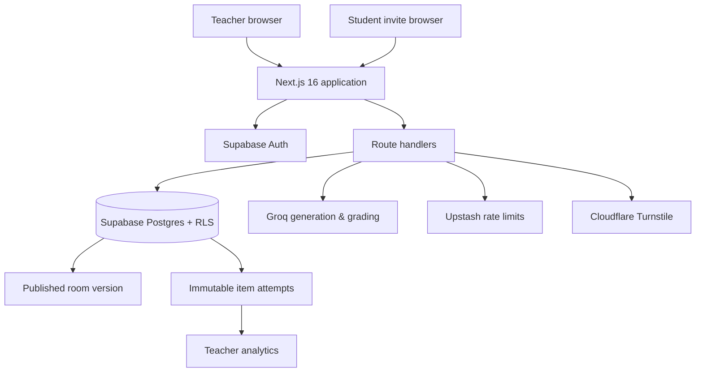
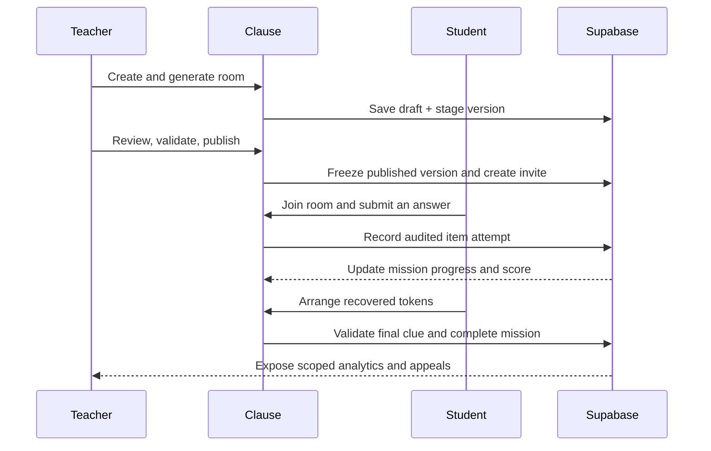

# Clause

<p align="center">
  <strong>Story-led grammar missions with teacher control and actionable classroom insight.</strong>
</p>

<p align="center">
  <a href="https://clause-learn.vercel.app"></a>
  <a href="https://github.com/not3zra/clause/actions/workflows/quality.yml"></a>
  
  
  
</p>

Clause turns grammar practice into short, teacher-reviewed missions. Teachers generate and publish a themed room; students solve staged language puzzles and a final token lock; the teacher dashboard surfaces completion, scoring, first-attempt accuracy, hints, and appeals.

**[Open the live app](https://clause-learn.vercel.app)** · **[Read deployment notes](docs/DEPLOYMENT.md)** · **[Report an issue](https://github.com/not3zra/clause/issues)**

## At a glance

| Teacher experience | Student experience | Built for accountability |
| --- | --- | --- |
| Create a class, generate a room, review it, then publish a room-specific invite. | Work through story-led grammar stages, recover tokens, and solve the final clue. | Frozen published room versions, immutable item-attempt evidence, scoped analytics, and appeals. |

## Product walkthrough

| Teacher studio | Student mission | Results dashboard |
| --- | --- | --- |
| _Screenshot placeholder — add `docs/screenshots/teacher-studio.png`_ | _Screenshot placeholder — add `docs/screenshots/student-mission.png`_ | _Screenshot placeholder — add `docs/screenshots/results-dashboard.png`_ |

## Core capabilities

- **Guided room authoring** — teachers choose a grade, grammar focus, theme, and stage count; generated content remains editable and must be reviewed before publishing.
- **Reliable AI-assisted generation** — Groq drafts are structurally validated, rate-limited, retried for transient provider limits, and replaced with a theme-specific safe fallback when needed.
- **Mission-based learning** — students complete deterministic or free-text grammar activities, collect stage tokens, and solve an ordered final clue to finish.
- **Evidence-based feedback** — every submitted item records its answer, verdict, source, recommendation, credit, and hint usage as immutable evidence.
- **Teacher analytics** — teachers can inspect progress, first-attempt accuracy, scores, elapsed time, mastery signals, and appeal history for their own rooms.
- **Safety by design** — row-level access controls, server-side authorization, rate limiting, Turnstile support, and audit records protect classroom workflows.

## AI integration and guardrails

Clause uses Groq from server-side routes for room generation and semantic grading. The approved runtime model is `openai/gpt-oss-20b`, configured with `GROQ_API_KEY` and an optional `GROQ_MODEL` override constrained by the application.

AI is deliberately scoped to tasks where semantic interpretation adds value: generated room drafts, free-text grammar feedback, and appeal support. Deterministic sort and sequence mechanics remain app-graded, not model-graded. Requests use structured outputs, validate generated stages before publication, exclude student identity data, apply rate limits, and fall back to prepared instructional feedback when the provider cannot respond. See [docs/AI_GUARDRAILS.md](docs/AI_GUARDRAILS.md) and [docs/SECURITY_OPERATIONS.md](docs/SECURITY_OPERATIONS.md) for operational detail.

### GPT-5.6 and Codex

GPT-5.6 is not a runtime dependency of the deployed Clause application. It accelerated development through Codex: tracing the product requirements into the teacher/student flows, implementing and testing persistence and retry behavior, tightening the two-layer design system, generating the supporting documentation, and iterating on verification failures. The runtime model choice is documented separately above so the project makes a clear distinction between the development workflow (Codex, backed by GPT-5.6) and the deployed AI path (Groq, `openai/gpt-oss-20b`).

## Architecture



### Mission lifecycle



## Quick start

### Prerequisites

- Node.js 20+
- A Supabase project
- A Groq API key for AI generation and free-text grading

### Install

```bash
git clone https://github.com/not3zra/clause.git
cd clause
npm ci
copy .env.example .env.local
```

> On macOS or Linux, use `cp .env.example .env.local` instead of `copy`.

### Configure services

Populate `.env.local` from `.env.example`. Never commit real values.

| Service | Required variables | Purpose |
| --- | --- | --- |
| Supabase | `NEXT_PUBLIC_SUPABASE_URL`, `NEXT_PUBLIC_SUPABASE_PUBLISHABLE_KEY`, `SUPABASE_SECRET_KEY` | Authentication, data, RLS, and RPCs |
| Groq | `GROQ_API_KEY`, `GROQ_MODEL` | Room generation and free-text grading |
| Upstash | `UPSTASH_REDIS_REST_URL`, `UPSTASH_REDIS_REST_TOKEN` | Durable request limits |
| Turnstile | `TURNSTILE_SECRET_KEY`, `NEXT_PUBLIC_TURNSTILE_SITE_KEY` | Teacher sign-up protection |

The browser only ever receives the publishable key. Keep `SUPABASE_SECRET_KEY`, `GROQ_API_KEY`, `TURNSTILE_SECRET_KEY`, and `UPSTASH_REDIS_REST_TOKEN` server-side.

### Apply database migrations

Apply the SQL files in `supabase/migrations` to the connected Supabase project, in filename order:

```text
supabase/migrations/
```

These create the teacher, room, assignment, attempt, appeal, security, and room-version schema. The room-version migration also backfills the built-in three-stage grammar room used by the demo, so no separate seed script is required.

### Start the app

```bash
npm run dev
```

Open [http://localhost:3000](http://localhost:3000).

## Sample data and demo paths

- **Guest sample:** use **Try sample room** on the landing page. It runs without credentials and includes prepared retry and appeal states.
- **Teacher flow:** sign up in the teacher area, create a class, draft a room, complete review/validation, then publish and copy the home invite link.
- **Student flow:** open a published invite link, register with the requested student details, and continue a saved mission from the current stage.

The sample room contains deterministic fallback content. It remains fully usable if AI configuration is absent, rate-limited, or unavailable — the core loop is demonstrable without a live provider.

## Testing and verification

Run the primary quality checks before a demo or deployment:

```bash
npm run lint
npm run typecheck
npm test
npm run build
npm run test:e2e
```

Useful configuration and deployment checks:

```bash
npm run test:config
npm run verify:supabase
npm run test:ai-config
npm run verify:ai
npm run test:demo-smoke
SMOKE_URL=https://clause-learn.vercel.app npm run smoke:deployment
```

The automated suite covers the guest journey through retry, appeal, stage completion, and final lock; schema and security helpers; AI configuration; and deployment smoke validation.

## Project structure

```text
src/
  app/                 Next.js pages and route handlers
  components/          Teacher and student experiences
  lib/                 Validation, scoring, analytics, and service adapters
supabase/migrations/   Schema, RLS, audit, and RPC definitions
e2e/                   Browser journeys
scripts/               Configuration and deployment smoke checks
```

## Data and access model

- A **published room version** is frozen so an invite always points at the learning content students were assigned.
- Each student answer creates an **immutable item-attempt record**; denormalized progress and scores are updated server-side.
- Supabase **RLS policies** scope student data to the student and teacher data to rooms they own.
- The final clue is validated on the server; collecting the last token alone does not complete a mission.

## Key implementation decisions

- **Teacher control before play:** generated rooms are drafts and require review/validation before publishing.
- **Three attempts, then teaching:** a wrong free-text answer receives targeted feedback; after the third attempt, the correct answer and concise reasoning appear and the student can continue with guidance.
- **Fairness over brittle matching:** deterministic mechanics are scored locally, while free-text judgments can be appealed and resolved by the teacher.
- **Privacy by design:** students do not provide an email address; AI routes send only item/rubric context and the submitted answer, never learner identity data.
- **Theme separation:** the Clause shell is a clean learning platform; Detective Office, Cursed Castle, and Sci-Fi Lab styling belongs only inside an active room player.
- **Resilient demo behavior:** deterministic fallback content means the key learning loop remains demonstrable even when an external AI provider is unavailable.

## Deployment

Clause is designed for Vercel with Supabase, Groq, Upstash, and Turnstile. Set the `.env.example` variables in Vercel for both Production and Preview, apply migrations before a migration-bearing release, then run the deployment smoke test. See the [deployment runbook](docs/DEPLOYMENT.md) for the operational checklist and rollback guidance.

## Product and implementation notes

See [docs/PRD.md](docs/PRD.md) for MVP requirements and [docs/UI_UX_IMPLEMENTATION.md](docs/UI_UX_IMPLEMENTATION.md) for the UI implementation notes.

## Contributing

1. Create a branch from `main`.
2. Keep changes scoped and add or update tests when behavior changes.
3. Run the quality checks above.
4. Open a pull request with a concise description of the user-facing impact.

## License

This repository is private. All rights reserved.
